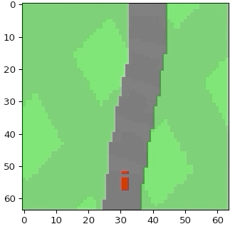
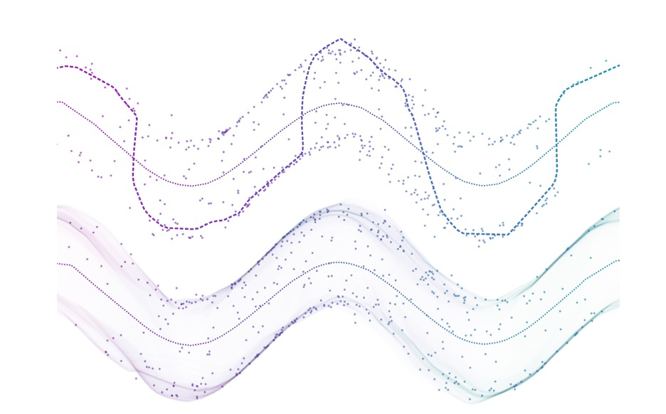

                                                               Project-World Models 
                                                  - Can agents learn inside of their own dreams?
                                                               - Submitted by:
                                                            Hemanth Grandhi- hg2315,
                                                            Deepankar Dixit - dd2943,
                                                            Divya Gupta- dg3483
                                                                 –May, 2021–
**Keywords: **
Model based Reinforcement learning , Recurrent neural network architecture (MDN-RNN), Variational autoencoder (VAE), Controller, Co-variance matrix adaptation evolution strategy (CMA-ES), Generative Adversarial neural network, VAE-GAN model

**Contents-:  **

1)  4-page report of the technique (a model-based RL) 
2)  Training V, M and C model 
3)  Issues faced while training above Agent 
4)  Results of training 
5)  A new approach that combines the VAE with a GAN 
6)  Problem with VAE-GAN implementation 
7)  Comparison between VAE and VAE-GAN 
8)  Conclusion 
9)  References 

**4-page report of the technique (a model-based RL) **

**Reinforcement learning** 

&nbsp;&nbsp;&nbsp;&nbsp;&nbsp;Reinforcement learning is concerned with how to go about making decisions and taking sequential actions in a specific environment to maximize a reward. Backed by computing power, it can explore different strategies (or “policies” in the Reinforcement Learning literature) much faster than we can. On other hand, the lack of prior knowledge that humans bring to new situations and environments, tends to explore many more policies than a human would before finding an optimal one.  

**Model-based and Model-free Reinforcement Learning** 

&nbsp;&nbsp;&nbsp;&nbsp;&nbsp;A model-based reinforcement learning attempts to overcome the issue of a lack of prior knowledge by enabling the agent, whether this agent happens to be a robot in the real world, an avatar in a virtual one, or just a piece of software that take actions, to construct a functional representation of its environment. Its potential impact is enormous. As AI becomes more complex and adaptive, extending beyond a focus on classification and representation toward more human-centered capabilities, model-based reinforcement learning will almost certainly play an essential role in shaping these frontiers.  

&nbsp;&nbsp;&nbsp;&nbsp;&nbsp;A model has a very specific meaning in reinforcement learning. It refers to the different dynamic states of an environment and how these states lead to a reward. Model-based reinforcement learning entails constructing such models. It tends to emphasize the planning part. By leveraging the information it’s learned about its environment, model-based RL can plan rather than just react, even simulating sequences of actions without having to directly perform them in the actual environment. It incorporates a model of the agent’s environment, specifically one that influences how the agent’s overall policy is determined. The advantage of using Model-based reinforcement learning is it can be transferable to other goals and tasks. Learning a single policy is good for one task but if we can predict the dynamics of the environment, we can generalize those insights to multiple tasks. On the other hand, its disadvantage is that we have to learn both the policy as well as a model which gives two different sources of approximation error and it is computationally demanding.   

&nbsp;&nbsp;&nbsp;&nbsp;&nbsp;Model-free reinforcement learning, conversely, forgoes this environmental information and only concerns itself with determining what action to take given a specific state. As a result, it only tends to emphasize learning..  

&nbsp;&nbsp;&nbsp;&nbsp;&nbsp;The difference between model-based and model-free can be understood by real-world analogy. In the navigation problem, we keep track of all the routes we have taken to begin creating a map of the area. The map would be incomplete but will still help us to plan the course ahead of time to avoid certain neighborhoods while still optimizing for the most direct route. We can think of it as the model-based approach. Another option is we would simply keep track of locations we visited and actions we have taken, ignoring the details of routes. Whenever we find ourselves in a location we visited, we favor the directional choice that leads to a good outcome over to the direction that led to a negative outcome. We will not know the next location we arrive following the decision but we have a simple procedure in place as to what action to be taken at a specific location. This approach is what model-free reinforcement learning takes. 

**Agent Model** 

&nbsp;&nbsp;&nbsp;&nbsp;&nbsp;In model-based reinforcement learning, the agent's model is inspired by our cognitive system. We as humans develop a mental model of the world based on what we can perceive with our limited senses. Our brain only learns an abstract representation of both spatial and temporal aspects of the information. We can only remember an abstract description of the information. There is evidence that what we perceive at any given moment is governed by our brain's future predictions based on an internal model.  It is predicting future sensory data given our current motor actions.  We instinctively act on this predictive model and were able to perform reflexive action in face of danger without the need to consciously planning out the course of action. 

&nbsp;&nbsp;&nbsp;&nbsp;&nbsp;World models in a similar fashion can be trained in an unsupervised manner to learn a compressed spatial and temporal representation of the environment.   We extract the features from the world model. That is used as input to agents.   We train these agents on a very compact and simple policy that can solve the required task. We have visual sensory components that compress what it sees into a small representative code. Memory component that makes predictions about future codes base on historical information. The Decision-making component decides what actions to be taken based only on the representations created by its vision and memory component. These three components Vision (V), Memory(M), and Controller (C) work together closely.  

**Vision (V) component** 

&nbsp;&nbsp;&nbsp;&nbsp;&nbsp;Variational autoencoder (VAE) is used as a V component. Agent gets a high dimensional input observation at each time step from the environment. These inputs are 2D image frames that are part of a video sequence. The V component learns abstract, compressed representation of each observed input frame. It compresses each frame it receives at time step t into low dimensional latent vector zt. This compressed representation can be used to the created original representation.  
 
&nbsp;&nbsp;&nbsp;&nbsp;&nbsp;&nbsp;&nbsp;&nbsp;&nbsp;&nbsp;&nbsp;&nbsp;&nbsp;&nbsp;&nbsp;&nbsp;&nbsp;&nbsp;&nbsp;&nbsp;&nbsp;&nbsp;&nbsp;&nbsp;&nbsp;&nbsp;&nbsp;&nbsp;&nbsp;&nbsp;&nbsp;&nbsp;&nbsp;&nbsp;&nbsp;&nbsp;&nbsp;&nbsp;&nbsp;&nbsp;&nbsp;&nbsp;&nbsp;&nbsp;&nbsp;&nbsp;&nbsp;&nbsp;&nbsp;&nbsp;&nbsp;&nbsp;&nbsp;&nbsp;&nbsp;&nbsp;&nbsp;&nbsp;&nbsp;&nbsp;&nbsp;&nbsp;&nbsp;&nbsp;&nbsp;&nbsp;&nbsp;&nbsp;&nbsp;&nbsp;Fig 1. VAE Architecture 

**Memory (M) component** 

&nbsp;&nbsp;&nbsp;&nbsp;&nbsp;M component is called a mixed density network combined with recurrent neural networks. The role of the M component is to predict the future. It is expected to produce predictions of z vectors that V models produce. Since we deal with a stochastic environment, we train our recurrent neural network to output probability density function p(z) instead of deterministic predictions of z.  p(z) is a mixture of Gaussian distributions. Given current and past information, we can train our recurrent neural network to output probability distribution of next latent vector zt+1. More specifically, recurrent neural network will produce model P(zt+1 | at, zt, ht), where at is action taken at time t, ht is hidden state of recurrent neural network at time t. We control model uncertainty by adjusting the temperature parameter.  
 
&nbsp;&nbsp;&nbsp;&nbsp;&nbsp;&nbsp;&nbsp;&nbsp;&nbsp;&nbsp;&nbsp;&nbsp;&nbsp;&nbsp;&nbsp;&nbsp;&nbsp;&nbsp;&nbsp;&nbsp;&nbsp;&nbsp;&nbsp;&nbsp;&nbsp;&nbsp;&nbsp;&nbsp;&nbsp;&nbsp;&nbsp;&nbsp;&nbsp;&nbsp;&nbsp;&nbsp;&nbsp;&nbsp;&nbsp;&nbsp;&nbsp;&nbsp;&nbsp;&nbsp;&nbsp;&nbsp;&nbsp;&nbsp;&nbsp;&nbsp;&nbsp;&nbsp;&nbsp;&nbsp;&nbsp;&nbsp;&nbsp;&nbsp;&nbsp;&nbsp;&nbsp;&nbsp;&nbsp;&nbsp;&nbsp;&nbsp;&nbsp;&nbsp;&nbsp;&nbsp;Fig 2. M Component 
&nbsp;&nbsp;&nbsp;&nbsp;&nbsp;We use recurrent neural networks to implement these powerful predictive models. Large recurrent neural networks are highly expressive models that can learn rich spatial and temporal representations of data. However, reinforcement learning algorithms are often bottle-necked by the credit assignment problem which makes it harder for these algorithms to learn millions of weights of a large model. Hence in practice, smaller networks are used to iterate faster to a good policy during training.  

**Controller (C)**  

&nbsp;&nbsp;&nbsp;&nbsp;&nbsp;The controller component determines the course of action taken to maximize the expected cumulative reward of the agent during the roll-out of the environment. It is made simple and small deliberately and made to train separately from V and M so that most of our agent's complexity lies resides in world models( V and M). It is simple single-layer linear model that maps zt and ht directly with at at each step.  
&nbsp;&nbsp;&nbsp;&nbsp;&nbsp;&nbsp;&nbsp;&nbsp;&nbsp;&nbsp;&nbsp;&nbsp;**at= Wc [zt ht] + Bc  **
where wc and Bc are weight matrix and bias vector respectively that concatenate input vector [zt ht] with output at. 

&nbsp;&nbsp;&nbsp;&nbsp;&nbsp;Together V, M and C works as follows. Raw observation first processed by V at each time step t to produce zt. The latent vector zt concatenated with M hidden state ht is passed to C. C will output an action vector at for motor control which effects the environment. M will take current vector zt and action vector at as input to update its hidden state to produce ht+1. After running this controller c will return the cumulative_reward during the roll-out.  
 
&nbsp;&nbsp;&nbsp;&nbsp;&nbsp;&nbsp;&nbsp;&nbsp;&nbsp;&nbsp;&nbsp;&nbsp;&nbsp;&nbsp;&nbsp;&nbsp;&nbsp;&nbsp;&nbsp;&nbsp;&nbsp;&nbsp;&nbsp;&nbsp;&nbsp;&nbsp;&nbsp;&nbsp;&nbsp;&nbsp;&nbsp;&nbsp;&nbsp;&nbsp;&nbsp;&nbsp;&nbsp;&nbsp;&nbsp;&nbsp;&nbsp;&nbsp;&nbsp;&nbsp;&nbsp;&nbsp;&nbsp;&nbsp;&nbsp;&nbsp;&nbsp;&nbsp;&nbsp;&nbsp;&nbsp;&nbsp;&nbsp;&nbsp;&nbsp;&nbsp;&nbsp;&nbsp;&nbsp;&nbsp;&nbsp;&nbsp;&nbsp;&nbsp;&nbsp;&nbsp;Fig 3. Agent Model 

&nbsp;&nbsp;&nbsp;&nbsp;&nbsp;We can train large and sophisticated models efficiently, provided we define well-behaved, differential loss functions. Most of the model complexity and model parameters would reside in V and M. Number of parameters in C are minimal in comparison to M and V. This allows us to explore more unconventional ways to train C example, even using evolution strategies (ES) to tackle more challenging RL tasks where credit assignment problem is difficult. Co-variance matrix adaptation evolution strategy (CMA-ES) is used to optimize the parameter C. It works well for solution spaces of up to a few thousand parameters.  

***

**Car racing experiment** 

&nbsp;&nbsp;&nbsp;&nbsp;&nbsp;In the in-car racing project, we are training a large neural network to tackle reinforcement learning tasks. An agent is divided into a large world model and a small controller model. We first train a large neural network to learn the model of Agents world in an unsupervised manner. Then we train the small controller model to learn to perform the task using the world model. Training algorithm of the small controller, focus on credit assignment problem on small search space while not sacrificing capacity and expressiveness via large world models. Training the agent through the lens of its world model, It was shown here that agent can learn highly compact policy to perform the task. 

&nbsp;&nbsp;&nbsp;&nbsp;&nbsp;Though we learn a model of the environment using traditional existing model-based reinforcement learning, we still train our controller in an actual environment. Here in this experiment, an actual reinforcement learning environment is replaced with the generated one. We trained our controller inside the environment generated by its internal world model and then transfer this policy back into the actual environment. We can produce the sample of a probability distribution of zt+1 given the current state and use those samples as real observations to produce a virtual environment. Adjustments are made in the temperature hyper-parameter of the internal world model to control the amount of uncertainty of the generated environments. This helps to overcome the problem of agents exploiting the imperfections of generated environment. We can also demonstrate that if we can train our agents' controller inside of a noisier and more uncertain version of its generated environment successfully, that agent will thrive in the original, cleaner environment.  

&nbsp;&nbsp;&nbsp;&nbsp;&nbsp;Using the M model to generate a virtual dream environment provides access to all the hidden states of the M component to the controller. Hence our agent can efficiently explore ways to directly manipulate the hidden states of the agent engine in its quest to maximize its expected cumulative reward. This is a downside of learning a policy inside a learned dynamics model. Our agent can easily find an adversarial policy that can fool our dynamics model, it’ll find a policy that looks good under our dynamics model, but will fail in the actual environment. This is the reason we do not replace the actual environment. Recent solutions combine a model-based approach with traditional model-free reinforcement learning training by first initializing the policy network with learned policy but subsequently, reply on model-free methods to fine-tune learned policy in an actual environment. 

&nbsp;&nbsp;&nbsp;&nbsp;&nbsp;Here in the car racing experiment, recurrent neural network M component is used to predict and plan step-by-step and we have used evolution to optimize C. Dynamic MDN-RNN is used as an M model to make it even harder for C to exploit its deficiencies. MDN-RNN models the distribution of possible outcomes in an actual environment rather than merely predicting a deterministic future. Even though the actual environment is deterministic, it would in effect approximate it as a stochastic environment. This gives us the advantage of training C in a stochastic version of any environment. We can control the trade-off between realism and exploitability by adjusting the temperature hyper-parameter. It also makes it easier to model the logic behind a more complicated environment with discrete random states.  

**Complex environments** 

&nbsp;&nbsp;&nbsp;&nbsp;&nbsp;In any difficult environment, where some parts of the world are made available to the agent only when it learns how to strategically navigate through the world. We need iterative training procedures to perform complicated tasks. Here agents can explore the world and constantly collect new observations to improve and refine its world model over time. An iterative training procedure is as follows.  
1) Initialize M, C with random model parameters. 
2) Roll-out to actual environment N times. Save all actions at and observations xt during roll-outs to storage. 
3) Train M to model P(xt+1, rt+1, at+1, dt+1| xt, at, ht)$ and train C to optimize expected rewards inside of M. 
4) Go back to (2) if the task has not been completed. 

&nbsp;&nbsp;&nbsp;&nbsp;&nbsp;In the present approach, MDN-RNN that models a probability distribution for the next frame. If it does a poor job, it means that it encounters the part of the world that it is not familiar with. In this case, We can reuse the M training loss function to encourage curiosity. We flipped the sign of M's loss function in the actual environment to encourage the agent to explore the parts of the world that it is not familiar with. New data collected improves the world model. The iterative training procedure requires the M model to also predict the action and reward for the next step. This is useful for more difficult tasks. For instance, we require a world model to imitate a controller that has already learned walking. Once the world model absorbs the skill of walking, the controller can rely on those skills and focus on learning more higher-level skills.  

**Scope of improvements in existing techniques** 

&nbsp;&nbsp;&nbsp;&nbsp;&nbsp;We have demonstrated the possibility of training an agent to perform tasks entirely inside of its simulated latent space dream world. This approach offers many practical benefits. For instance, to run computationally intensive engines, We may not want to waste cycles training an agent in the actual environment, but instead train the agent as many times as we want inside its simulated environment as training agents in the real world are more expensive. Another area is the choice of using and training VAE for the V model as a standalone model has its limitations as it can encode parts of observation that are not relevant to the task. We can train it with the M model that predicts rewards and VAE can learn t focus on learning task-relevant areas of the image. But the downside of using this technique is that we can not reuse VAE for new tasks without retraining. Future work is needed in replacing small MDN-RNN networks with higher capacity models. LSTM based models are not capable of storing all recorded information inside their weighted connections. It suffers from catastrophic forgetting. The recent approach is One Big Net. It collapses C and M into a single network and uses power play-like behavioral replay to avoid forgetting old predictions and control skills when learning the new one.  

**Training V, M and C model **

&nbsp;&nbsp;&nbsp;&nbsp;&nbsp;A predictive world model is used to extract useful representations of space and time. Using these features as inputs of a controller, we can train a compact and minimal controller to perform a continuous control task such as learning to drive from pixel inputs from a top-down car racing environment. A reward is -0.1 for every frame and + 1000/N for every track tile visited, where N is the total number of tiles in the track. For example, if you finished in 732 frames, your reward is 1000-0.1*732= 926.8 points. For good performance, we need to get 900+ points consistently. The track is random every episode. The episode finishes when all tiles are visited. If a cargo far off the track, then it will get -100 and die. The agent controls three continuous actions: steering left/right, acceleration and brake.  

&nbsp;&nbsp;&nbsp;&nbsp;&nbsp;First, collect a dataset of 2000 random rollouts of the environment. We have an agent acting randomly to explore the environment multiple times and record the random actions a_t taken and the resulting observations from the environment. 01_generate_data.py is used to collect this data in folder data\rollout.  

 
&nbsp;&nbsp;&nbsp;&nbsp;&nbsp;&nbsp;&nbsp;&nbsp;&nbsp;&nbsp;&nbsp;&nbsp;&nbsp;&nbsp;&nbsp;&nbsp;&nbsp;&nbsp;&nbsp;&nbsp;&nbsp;&nbsp;&nbsp;&nbsp;&nbsp;&nbsp;&nbsp;&nbsp;&nbsp;&nbsp;&nbsp;&nbsp;&nbsp;&nbsp;&nbsp;&nbsp;&nbsp;&nbsp;&nbsp;&nbsp;&nbsp;&nbsp;&nbsp;&nbsp;&nbsp;&nbsp;&nbsp;&nbsp;&nbsp;&nbsp;&nbsp;&nbsp;&nbsp;&nbsp;&nbsp;&nbsp;&nbsp;&nbsp;&nbsp;&nbsp;&nbsp;&nbsp;&nbsp;&nbsp;&nbsp;&nbsp;&nbsp;&nbsp;&nbsp;&nbsp;Fig 4. Screen shot of 01_generate_data.py 

&nbsp;&nbsp;&nbsp;&nbsp;&nbsp;We use this dataset to train V to learn a latent space of each frame observed. We encode each frame in low dimensional latent vector z_t by minimizing the difference between a given frame and the reconstructed version of the frame produced by the decoder from z. 02_train_vae.py is used to train over 100 episodes.  

 
&nbsp;&nbsp;&nbsp;&nbsp;&nbsp;&nbsp;&nbsp;&nbsp;&nbsp;&nbsp;&nbsp;&nbsp;&nbsp;&nbsp;&nbsp;&nbsp;&nbsp;&nbsp;&nbsp;&nbsp;&nbsp;&nbsp;&nbsp;&nbsp;&nbsp;&nbsp;&nbsp;&nbsp;&nbsp;&nbsp;&nbsp;&nbsp;&nbsp;&nbsp;&nbsp;&nbsp;&nbsp;&nbsp;&nbsp;&nbsp;&nbsp;&nbsp;&nbsp;&nbsp;&nbsp;&nbsp;&nbsp;&nbsp;&nbsp;&nbsp;&nbsp;&nbsp;&nbsp;&nbsp;&nbsp;&nbsp;&nbsp;&nbsp;&nbsp;&nbsp;&nbsp;&nbsp;&nbsp;&nbsp;&nbsp;&nbsp;&nbsp;&nbsp;&nbsp;&nbsp;Fig 5. Screen shot of 02_train_vae.py 

Below we can see the result of one episode.  

 
&nbsp;&nbsp;&nbsp;&nbsp;&nbsp;&nbsp;&nbsp;&nbsp;&nbsp;&nbsp;&nbsp;&nbsp;&nbsp;&nbsp;&nbsp;&nbsp;&nbsp;&nbsp;&nbsp;&nbsp;&nbsp;&nbsp;&nbsp;&nbsp;&nbsp;&nbsp;&nbsp;&nbsp;&nbsp;&nbsp;&nbsp;&nbsp;&nbsp;&nbsp;&nbsp;&nbsp;&nbsp;&nbsp;&nbsp;&nbsp;&nbsp;&nbsp;&nbsp;&nbsp;&nbsp;&nbsp;&nbsp;&nbsp;&nbsp;&nbsp;&nbsp;&nbsp;&nbsp;&nbsp;&nbsp;&nbsp;&nbsp;&nbsp;&nbsp;&nbsp;&nbsp;&nbsp;&nbsp;&nbsp;&nbsp;&nbsp;&nbsp;&nbsp;&nbsp;&nbsp;Fig 6. Screen shot of check_02_vae.ipynb 

&nbsp;&nbsp;&nbsp;&nbsp;&nbsp;We can now use our trained V model to pre-process each frame at time t into z_t to train our M model. Pre-processed data, along with the recorded random actions a_t taken, our MDN-RNN can now be trained to model P(zt+1 | at, zt, ht) as a mixture of Gaussians. 03_generate_rnn_data.py preprocessed data and store in data/series folder.  

 
&nbsp;&nbsp;&nbsp;&nbsp;&nbsp;&nbsp;&nbsp;&nbsp;&nbsp;&nbsp;&nbsp;&nbsp;&nbsp;&nbsp;&nbsp;&nbsp;&nbsp;&nbsp;&nbsp;&nbsp;&nbsp;&nbsp;&nbsp;&nbsp;&nbsp;&nbsp;&nbsp;&nbsp;&nbsp;&nbsp;&nbsp;&nbsp;&nbsp;&nbsp;&nbsp;&nbsp;&nbsp;&nbsp;&nbsp;&nbsp;&nbsp;&nbsp;&nbsp;&nbsp;&nbsp;&nbsp;&nbsp;&nbsp;&nbsp;&nbsp;&nbsp;&nbsp;&nbsp;&nbsp;&nbsp;&nbsp;&nbsp;&nbsp;&nbsp;&nbsp;&nbsp;&nbsp;&nbsp;&nbsp;&nbsp;&nbsp;&nbsp;&nbsp;&nbsp;&nbsp;Fig 7. Screen shot of 03_generate_rnn_data.py 

We then train our M component using 04_train_rnn.py  

 
&nbsp;&nbsp;&nbsp;&nbsp;&nbsp;&nbsp;&nbsp;&nbsp;&nbsp;&nbsp;&nbsp;&nbsp;&nbsp;&nbsp;&nbsp;&nbsp;&nbsp;&nbsp;&nbsp;&nbsp;&nbsp;&nbsp;&nbsp;&nbsp;&nbsp;&nbsp;&nbsp;&nbsp;&nbsp;&nbsp;&nbsp;&nbsp;&nbsp;&nbsp;&nbsp;&nbsp;&nbsp;&nbsp;&nbsp;&nbsp;&nbsp;&nbsp;&nbsp;&nbsp;&nbsp;&nbsp;&nbsp;&nbsp;&nbsp;&nbsp;&nbsp;&nbsp;&nbsp;&nbsp;&nbsp;&nbsp;&nbsp;&nbsp;&nbsp;&nbsp;&nbsp;&nbsp;&nbsp;&nbsp;&nbsp;&nbsp;&nbsp;&nbsp;&nbsp;&nbsp;Fig 8. Screen shot of 04_train_rnn.py 

&nbsp;&nbsp;&nbsp;&nbsp;&nbsp;The world model (V and M) does not know actual reward signals from the environment. Its task is simply to compress and predict the sequence of image frames observed. Controler functions have access to reward information from the environment. CMA-ES evolutionary algorithm is well suited to optimize parameters inside the linear controller model. To train our controller we have to use 05_train_controller.py. 

 
&nbsp;&nbsp;&nbsp;&nbsp;&nbsp;&nbsp;&nbsp;&nbsp;&nbsp;&nbsp;&nbsp;&nbsp;&nbsp;&nbsp;&nbsp;&nbsp;&nbsp;&nbsp;&nbsp;&nbsp;&nbsp;&nbsp;&nbsp;&nbsp;&nbsp;&nbsp;&nbsp;&nbsp;&nbsp;&nbsp;&nbsp;&nbsp;&nbsp;&nbsp;&nbsp;&nbsp;&nbsp;&nbsp;&nbsp;&nbsp;&nbsp;&nbsp;&nbsp;&nbsp;&nbsp;&nbsp;&nbsp;&nbsp;&nbsp;&nbsp;&nbsp;&nbsp;&nbsp;&nbsp;&nbsp;&nbsp;&nbsp;&nbsp;&nbsp;&nbsp;&nbsp;&nbsp;&nbsp;&nbsp;&nbsp;&nbsp;&nbsp;&nbsp;&nbsp;&nbsp;Fig 9. Screen shot of 05_train_controller.py 

&nbsp;&nbsp;&nbsp;&nbsp;&nbsp;To summarize the Car Racing experiment, below are the steps taken: 
1. Collect 2000 rollouts from a random policy. 
2. Train VAE (V) to encode frames into z 2 R32. 
3. Train MDN-RNN (M) to model P(zt+1 | at; zt; ht). 
4. Define Controller (C) as at = Wc [zt ht] + bc. 
5. Use CMA-ES to solve for a Wc and bc that maximizes the expected cumulative reward. 

**Issues faced while training above Agent **

We ran into several issues from environment setup to the training of the agent. Some of them are listed below. 
1) Connection with EC2 instance. Permission issues with .pem file.  
2) Issues with VS terminal setup. 
3) Not enough compute and memory resources to successfully train the VAE model. Our instances were getting killed due to errors exceed 10% of free system memory. 
4) After long hours of training, the host system turn to sleep mode and lost connection with the remote machine. Thus interrupting the training.  
5) Issues with the abrupt termination of EC2 instances due to several reasons. 
6) Issues with WSL and docker installation and setup in local machines like system requirements constrained, Issues with starting Docker daemon, Issues with building docker image, etc. 

**Results of training **

Though we ran into several problems, we were able to overcome the main problem of not having enough system memory allocation, by using a VAE model from a different source and training it with the limited environment. On proceeding with the remaining steps, we observed results similar to the reference paper. The RNN model training resulted in an accurate model, and upon verifying it with the notebooks, gave suitable results. The training of the controller was where we a slight deviation from the paper. In the initial stages of training, the average reward was stuck in the negative range, and even after several hours of training, we would observe a sudden dip in the average reward for a particular episode. The highest average reward we recorded was 173.09, in the 256th episode. When we proceeded to check the controller behavior using the corresponding notebooks, we observed that it did however behave as expected in most situations, but faced a bit of difficulty at the turns. 

 
&nbsp;&nbsp;&nbsp;&nbsp;&nbsp;&nbsp;&nbsp;&nbsp;&nbsp;&nbsp;&nbsp;&nbsp;&nbsp;&nbsp;&nbsp;&nbsp;&nbsp;&nbsp;&nbsp;&nbsp;&nbsp;&nbsp;&nbsp;&nbsp;&nbsp;&nbsp;&nbsp;&nbsp;&nbsp;&nbsp;&nbsp;&nbsp;&nbsp;&nbsp;&nbsp;&nbsp;&nbsp;&nbsp;&nbsp;&nbsp;&nbsp;&nbsp;&nbsp;&nbsp;&nbsp;&nbsp;&nbsp;&nbsp;&nbsp;&nbsp;&nbsp;&nbsp;&nbsp;&nbsp;&nbsp;&nbsp;&nbsp;&nbsp;&nbsp;&nbsp;&nbsp;&nbsp;&nbsp;&nbsp;&nbsp;&nbsp;&nbsp;&nbsp;&nbsp;&nbsp;Fig 10. Controller Behaviour 

We believe this is due to insufficient time spent training, due to the time constraint. It should also be noted that not being able to train the VAE model due to the memory bandwidth could have also led to this problem. Overall the VAE model produced results similar to the paper and had slight issues, which could have been addressed with enough time.

***

**A new approach that combines the VAE with a GAN **

&nbsp;&nbsp;&nbsp;&nbsp;&nbsp;The Generative Model expended in this paper is the Wasserstein GAN since it eradicates the matter of union and model collapse. The Autoencoder model is a Variational model. Once the image produced by the GAN is diagramed onto the latent space by training the autoencoder, the decoder will plot it back to an image of enhanced quality. This process of generating images is particularly beneficial in the case of small datasets with a wide variety of image production with inadequate processing power. The Variational Autoencoder plots the training images and the generated images on the latent space. Once plotted, the decoder yields an image of better quality by sampling from the latent space. 

&nbsp;&nbsp;&nbsp;&nbsp;&nbsp;Both systems work independently of each other. The WGAN takes the authentic images and generates bogus images. The loss for the generator & discriminator is used to recover their functioning. Subsequently, the critic reiteration is completed and the images produced with the existing weights are fed into the Autoencoder alongside the training data. This is mapped onto the latent space and random samples are reserved from it. This intention to develop the feature of an image generated by the GAN as well as to intensify deviations in the generated images.   

&nbsp;&nbsp;&nbsp;&nbsp;&nbsp;To influence both the benefits of GANs and VAEs, anticipated the VAE/GAN architecture which combines them. They offer to complement a discriminator to effort reconstructions from the VAE concerning more pragmatism and substituted the standard reconstruction error by a perceptual resemblance metric grounded on the filters cultured by the discriminator. This method is problematic because the discriminator is qualified to predict whether an image is a genuine one or a bogus one. Thus, the qualities obtained from it may not be reformed to label image content creating them a questionable choice to base a resemblance metric on.   

&nbsp;&nbsp;&nbsp;&nbsp;&nbsp;We commence by trying our method on a doll dataset to substantiate the theory. The dataset is comprised of 2D points produced from two generative factors z1 and z2. For the model, we use a latent space of dimension one to mimic the problem of the low dimensionality of the latent space paralleled to the high dimensionality of the diverse data. Models are two-hidden-layer perceptrons with 128 units. Models are trained with the process labeled projected here. We then draw various of the generated points to see in what way the model performs matched to a VAE. 

Results of this experiment can be seen in the figure below where we can see that reconstructions from the VAE are in an area of the low likelihood of the data distribution while AVAE reconstructions follow the shape of the VAE manifold while covering regions of higher likelihood. It demonstrates that our model can construct realistic reconstructions even when the hidden code does not comprise all the information needed to reconstruct the original image perfectly. Here there is vagueness as we cannot identify if the original illustration is from the top distribution or the bottom one gave a latent code that corresponds to two. In command to create an accurate result the generator has to make a random choice. Our method permits the generator to mark such choices whereas the decoder from the VAE yields the average of potential choices stemming in an improbable/impractical reconstruction.  

 
&nbsp;&nbsp;&nbsp;&nbsp;&nbsp;&nbsp;&nbsp;&nbsp;&nbsp;&nbsp;&nbsp;&nbsp;&nbsp;&nbsp;&nbsp;&nbsp;&nbsp;&nbsp;&nbsp;&nbsp;&nbsp;&nbsp;&nbsp;&nbsp;&nbsp;&nbsp;&nbsp;&nbsp;&nbsp;&nbsp;&nbsp;&nbsp;&nbsp;&nbsp;&nbsp;&nbsp;&nbsp;&nbsp;&nbsp;&nbsp;&nbsp;&nbsp;&nbsp;&nbsp;&nbsp;&nbsp;&nbsp;&nbsp;&nbsp;&nbsp;&nbsp;&nbsp;&nbsp;&nbsp;&nbsp;&nbsp;&nbsp;&nbsp;&nbsp;&nbsp;&nbsp;&nbsp;&nbsp;&nbsp;&nbsp;&nbsp;&nbsp;&nbsp;&nbsp;&nbsp;Fig 11. Comparison between two models 

**Problem with VAE-GAN implementation **
Changing to the VAE-GAN model, proved quite difficult both in terms of time required and the integration with the existing codebase. The first issue we ran into was fitting the data generated from the first step and feed it into the parts of the VAE-GAN architecture. Moreover, we then had to package the model in such a way that it would be useable for further steps. With the help of the /var-gan-tf2 repo by Leo Heidel, we were able to make modifications to the existing code, by changing the build function and the brain function. We implemented the encoder, generator, and discriminator components in our vaeganarch.py file, and then used a build function to build all the respective components. Further, we then modified the existing train step function, to take in the data from step one, train the model and then package the results in a manner that can be used by the subsequent steps. However, due to the time constraint, we were unable to train it for long periods and could not run the entire cycle again to compare the performance to the regular VAE version.

**Comparison between VAE and VAE-GAN **

 &nbsp;&nbsp;&nbsp;&nbsp;&nbsp;As discussed above VAEs consist of pair of networks that is pair of encoders and decoders. The encoder is responsible for the mapping of input x to posterior distributions and the decoder is responsible for sampling randomly from these posterior distributions for input vectors. It produces blurry outputs that have to do with how data distributions are recovered and loss functions are calculated in VAEs.  
 
&nbsp;&nbsp;&nbsp;&nbsp;&nbsp;In comparison to VAEs, GANs( generative neural networks) consist of two parts. Generative neural network and discriminator neural network. The generative neural network is responsible for making noise as input and generating samples. Then the discriminative neural network is asked to evaluate and distinguish the generated samples from training data. The major goal of the generative neural network is to fool the discriminator neural network that increases the error rate. That can be done by generating samples that appear to be from training data.  

&nbsp;&nbsp;&nbsp;&nbsp;&nbsp;&nbsp;&nbsp;&nbsp;&nbsp;&nbsp;&nbsp;&nbsp;&nbsp;&nbsp;&nbsp;&nbsp;&nbsp;&nbsp;&nbsp;&nbsp;&nbsp;&nbsp;&nbsp;&nbsp;&nbsp;&nbsp;&nbsp;&nbsp;&nbsp;&nbsp;&nbsp;&nbsp;&nbsp;&nbsp;&nbsp;&nbsp;&nbsp;&nbsp;&nbsp;&nbsp;&nbsp;&nbsp;&nbsp;&nbsp;&nbsp;&nbsp;&nbsp;&nbsp;&nbsp;&nbsp;&nbsp;&nbsp;&nbsp;&nbsp;&nbsp;&nbsp;&nbsp;&nbsp;&nbsp;&nbsp;&nbsp;&nbsp;&nbsp;&nbsp;&nbsp;&nbsp;&nbsp;&nbsp;&nbsp;&nbsp;Fig 12. GAN Architecture 

&nbsp;&nbsp;&nbsp;&nbsp;&nbsp;In the VAE-GAN model, the authors of the paper “Autoencoding beyond pixels using a learned similarity metric” suggested that by combining a variational autoencoder with the generative adversarial network, we can use learned feature representations in the GAN discriminator as a basis for the VAE reconstruction objective. Thus we are replacing element-wise errors with feature-wise errors to capture data distribution much better while offering invariance towards translation.  

&nbsp;&nbsp;&nbsp;&nbsp;&nbsp;&nbsp;&nbsp;&nbsp;&nbsp;&nbsp;&nbsp;&nbsp;&nbsp;&nbsp;&nbsp;&nbsp;&nbsp;&nbsp;&nbsp;&nbsp;&nbsp;&nbsp;&nbsp;&nbsp;&nbsp;&nbsp;&nbsp;&nbsp;&nbsp;&nbsp;&nbsp;&nbsp;&nbsp;&nbsp;&nbsp;&nbsp;&nbsp;&nbsp;&nbsp;&nbsp;&nbsp;&nbsp;&nbsp;&nbsp;&nbsp;&nbsp;&nbsp;&nbsp;&nbsp;&nbsp;&nbsp;&nbsp;&nbsp;&nbsp;&nbsp;&nbsp;&nbsp;&nbsp;&nbsp;&nbsp;&nbsp;&nbsp;&nbsp;&nbsp;&nbsp;&nbsp;&nbsp;&nbsp;&nbsp;&nbsp;Fig 13. VAE-GAN Architecture 

The loss function of VAE model is -:  
Lvae= MSE (Dl(xdecoder), Dl(xreal))+ prior  
and loss function of GAN is -: 
LGAN= Ex ~pdata log (D(X)) + Ex ~pmodel log (1-D(X))  

&nbsp;&nbsp;&nbsp;&nbsp;&nbsp;Here the above equations assume the lth layer discriminator has outputs that differ in a gaussian manner. As a result, calculating the mean squared error (MSE) between the lth layer outputs gives us the VAE’s loss function. The final output of GAN, D(x), can then be used to calculate its loss function.  

**Conclusion **
We have seen how it is possible to train an agent to perform tasks inside a simulation. This concept can be useful in multiple domains in the current period. It greatly decreases the need to gather painstakingly large amounts of real-world data for training. Moreover, it is becoming easier and easier to simulate real-world scenarios. We can also control the parameters and environment completely, which allows for more directed training. We can also use this process for transfer learning and defining policies that can be learned for different use cases. This training and implementation can be highly improved in a deep learning setting and with the use of GPUs to help accelerate the testing and training process. We can also possibly use this methodology to allow the agent to learn not just one particular but integrate multiple domains and aid in creating a general agent which can perform various tasks across varying domains. We have seen that the VAE model has its limitations and that other models can potentially have better results. Through testing and implementation with different architectures can help improve this method greatly. This project proceeded in a limited capacity, the simulation was far too simple to be useful in real-world examples. We would need to introduce more complex factors and parameters to see how efficient the procedure truly is. We might also need to consider some more complex neural networks to hold the weights and complex arguments that come with a more complex simulated world. Overall, simulated learning environments can be very useful for the training of agents, and has a broad scope in the future of reinforcement learning.

**References **

1) https://medium.com/the-official-integrate-ai-blog/understanding-reinforcement-learning-93d4e34e5698 
2) https://medium.com/applied-data-science/how-to-build-your-own-world-model-using-python-and-keras-64fb388ba459 
3) https://arxiv.org/pdf/1803.10122.pdf 
4) https://towardsdatascience.com/what-the-heck-are-vae-gans-17b86023588a 
5) https://medium.com/@lishuo1/which-one-should-you-choose-gan-or-vae-part-i-da92acb4ab3e#:~:text=They%20are%20both%20generative%20models&text=By%20rigorous%20definition%2C%20VAE%20models,that%20could%20fool%20the%20discriminator. 
6) https://arxiv.org/pdf/1512.09300.pdf 
